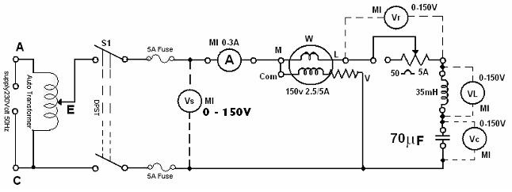

### Procedure

								<b>Circuit Diagram:</b>
								 <figure style="text-align:center">
									  
									  <figcaption>[Fig 1: Circuit Diagram for experimental set-up of R-L-C circuit analysis]</figcaption>
								</figure> 
								

								<ol type="1">
								<li>Connect the circuit as shown in the diagram in figure 1.</li>
								 <li>Adjust the rheostat for maximum resistance and the auto transformer to the position of zero-output voltage and switch on the supply.</li> 
								 <li>Adjust the voltage across the circuit to about 70 V and note 
                                $$I, V_s, V_L, V_C, V_R$$ and $$W$$.</li>
								 <li> Adjust the rheostat for several settings and repeat step 3.</li>
								 <li>Adjust the rheostat to the maximum setting and change the capacitance to 140 μF and repeat step 4.</li>
								 <li> Compare the values of phase angle as obtained from the meter readings and from the phasor diagrams. (From the phasor diagrams compute cosθ and θ). Draw phasor diagrams showing 
                                $$I, V_s, V_L, V_C,$$ and $$V_R$$ for different sets of readings.</li>
								 
								 
								 
								</ol>
								

							
     
							
