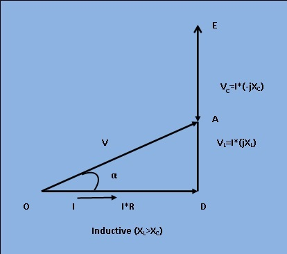

### Theory
<figure style="text-align:center">

<figcaption>[Fig 1: Sinusoidal input to series RLC circuit]</figcaption>
</figure> 
With reference to figure 1, the application of Kirchoff's law results,
$$V=I R + jIX_L + \frac{I}{j\omega C}$$ ,
Where,
$$V_R = IR, V_L=jIX_L, V_C=\frac{I}{j\omega C}$$
$$V=I(R+j\omega L+\frac{1}{j\omega C})$$ .......(1)
Let Z be the net impedance of the circuit, this gives from equation(1),
$$V=IZ=I(R+j\omega L+\frac{1}{j\omega C})$$
Or,
$$Z=R+j(\omega L - \frac{1}{\omega C})=\sqrt(R^2+(\omega L - \frac{1}{\omega C})^2) \angle \tan^{-1}(\frac{\omega L - \frac{1}{\omega C}}{R})$$ ........ (2)
Equation (2) gives the complex impedance(Z) which indicates that the circuit will become inductive if 
$$\omega L > \frac{1}{\omega C}$$
and then the sign of the angle of Z is positive. On the other hand, for 
$$\omega L < \frac{1}{\omega C}$$ 
, the circuit will become capacitive and the sign of the angle of Z is negative.
  
<b>Phasor Diagram:</b>
   The phasor diagram for Inductive and capacitive series R-L-C circuit is given in figure 2 and 3 respectively.  
<figure style="text-align:center">

<figcaption>[Fig 2: Phasor diagram for inductive circuit]</figcaption>
</figure>
  <figure style="text-align:center">

<figcaption>[Fig 3: Phasor diagram for capacitive circuit]
</figcaption>
</figure><   